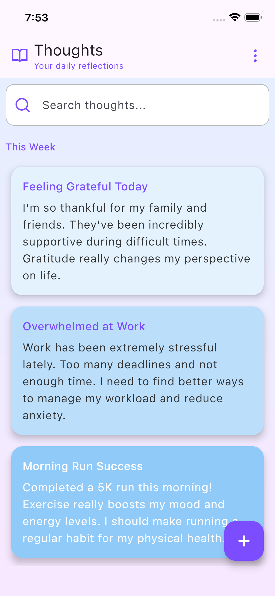
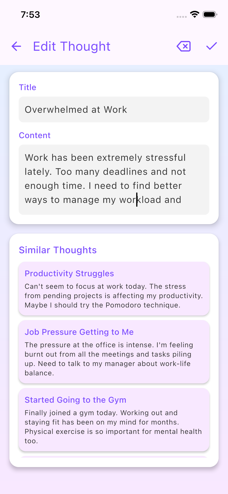
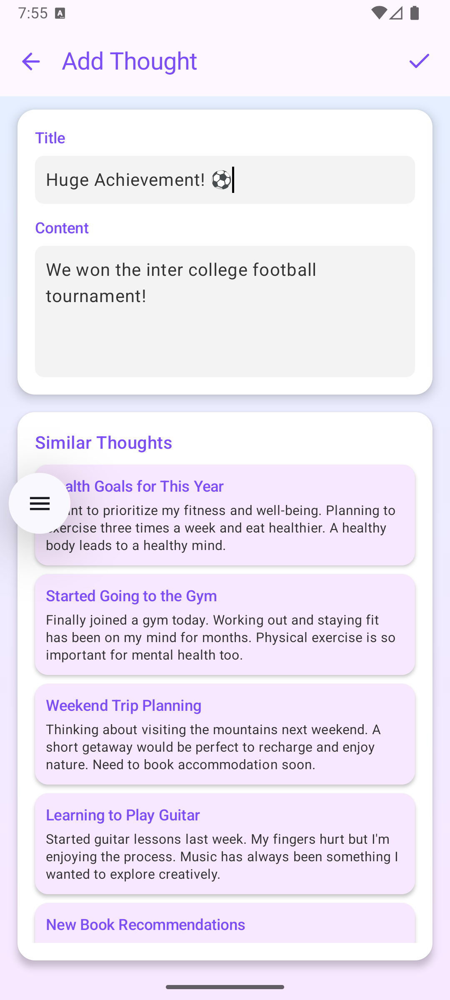
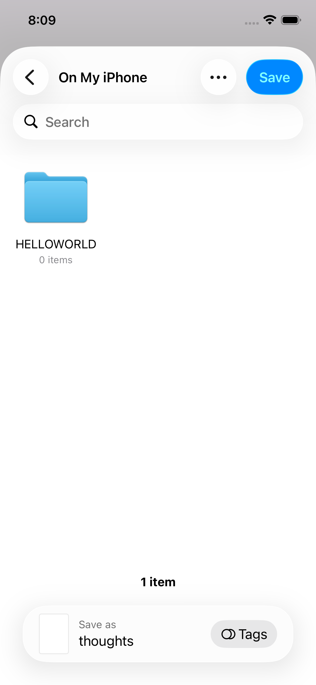
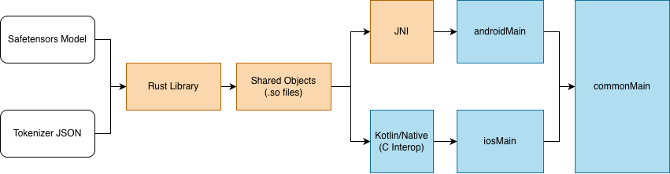
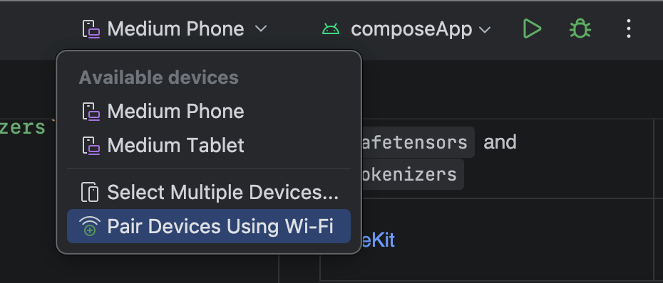
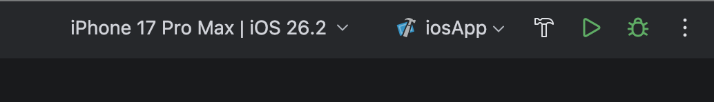

# Constellation - Journal and Revisit Your Thoughts

Constellation is an app that lets you journal your thoughts and revisit older entries that you find similar.

|                    |                                   |                                  |                 |
|----------------------------------------|-------------------------------------------------------|------------------------------------------------------|-------------------------------------|
| Thoughts are colored as per their tone | View similar thoughts when creating/editing a thought | View details of a thought including similar thoughts | Export/Import thoughts as JSON file |

https://github.com/user-attachments/assets/64e53816-9cd3-4891-b318-6cb4e057ef45

## Features

- Add/Edit/Update Thoughts
- Check semantically similar thoughts when creating/editing a thought
- Export/Import thoughts as a JSON file

## Architecture



## Tools

| Tool                                                                                                                                                                                                                    | Use                                                                       |
|-------------------------------------------------------------------------------------------------------------------------------------------------------------------------------------------------------------------------|---------------------------------------------------------------------------|
| [Compose Multiplatform](https://www.jetbrains.com/compose-multiplatform/)                                                                                                                                               | Shared UI across the Android and iOS apps                                 |
| [AndroidX ViewModel](https://developer.android.com/kotlin/multiplatform/viewmodel)                                                                                                                                      | Manage UI states and events, interacting with DB and `model2vec`          |
| [AndroidX Room](https://developer.android.com/kotlin/multiplatform/room)                                                                                                                                                | SQLite-based ORM for persisting thoughts and embeddings                   |
| [Kotlin/Native](https://kotlinlang.org/docs/native-c-interop.html)                                                                                                                                                      | Interop with the native Rust library `model2vec`                          |
| [Koin](https://insert-koin.io/docs/quickstart/kmp)                                                                                                                                                                      | Dependency Injection for KMP                                              |
| [NaturalLangauge](https://developer.apple.com/documentation/NaturalLanguage) library and [LiteRT's NLBertClassifier](https://ai.google.dev/edge/litert/libraries/task_library/bert_nl_classifier#run_inference_in_java) | Sentiment analysis for Android and iOS                                    |
| The Rust toolchain with crates `safetensors` and `tokenizers`                                                                                                                                                           | Building the native library to tokenize given text and produce embeddings |
| [FileKit](https://github.com/vinceglb/FileKit)                                                                                                                                                                          | KMP library for loading/saving files                                      | 

## Setup

### Building the KMP App

Clone the project:

```bash
git clone --depth=1 https://github.com/shubham0204/constellation
```

Pre-requisites:

- macOS 26.2 and Xcode 26.2
- JDK 21 (Temurin)
- IntelliJ IDEA 2025.3 with KMP plugin

#### Build and Run Android Application

Executing from IntelliJ IDEA:



To build and run the development version of the Android app, use the run configuration from the run widget
in your IDE’s toolbar or build it directly from the terminal:

- on macOS/Linux
  ```shell
  ./gradlew :composeApp:assembleDebug
  ```
- on Windows
  ```shell
  .\gradlew.bat :composeApp:assembleDebug
  ```

#### Build and Run iOS Application

Executing from IntelliJ IDEA:



To build and run the development version of the iOS app, use the run configuration from the run widget
in your IDE’s toolbar or open the [/iosApp](./iosApp) directory in Xcode and run it from there.

### Building the Native Library

#### Building the Native Library for the KMP app

To compile the native library, you need to have the Rust toolchain installed on your system.

Add Android-specific compilation targets to the Rust toolchain:

```bash
rustup target add aarch64-linux-android armv7-linux-androideabi i686-linux-android x86_64-linux-android
```

The library has a dependency (a crate/package in Rust) `onig` which needs a C++ compiler for the target. For Android
targets, the C++ compilers are provided by the Android NDK. Install Android NDK and copy the path to its directory.

Create `config.toml` in the `model2vec-rs/.cargo` directory and add the following, replacing `<android-ndk-dir>` with
the copied path of the Android NDK directory.

```toml

[target.aarch64-linux-android]
linker = "<android-ndk-dir>/toolchains/llvm/prebuilt/darwin-x86_64/bin/aarch64-linux-android33-clang"

[target.armv7-linux-androideabi]
linker = "<android-ndk-dir>/toolchains/llvm/prebuilt/darwin-x86_64/bin/armv7a-linux-androideabi33-clang"

[target.i686-linux-android]
linker = "<android-ndk-dir>/toolchains/llvm/prebuilt/darwin-x86_64/bin/i686-linux-android33-clang"

[target.x86_64-linux-android]
linker = "<android-ndk-dir>/toolchains/llvm/prebuilt/darwin-x86_64/bin/x86_64-linux-android33-clang"

[env]
AR_aarch64-linux-android = "<android-ndk-dir>/toolchains/llvm/prebuilt/darwin-x86_64/bin/llvm-ar"
CC_aarch64-linux-android = "<android-ndk-dir>/toolchains/llvm/prebuilt/darwin-x86_64/bin/aarch64-linux-android33-clang"
CXX_aarch64-linux-android = "<android-ndk-dir>/toolchains/llvm/prebuilt/darwin-x86_64/bin/aarch64-linux-android33-clang++"

AR_armv7-linux-androideabi = "<android-ndk-dir>/toolchains/llvm/prebuilt/darwin-x86_64/bin/llvm-ar"
CC_armv7-linux-androideabi = "<android-ndk-dir>/toolchains/llvm/prebuilt/darwin-x86_64/bin/armv7a-linux-androideabi33-clang"
CXX_armv7-linux-androideabi = "<android-ndk-dir>/toolchains/llvm/prebuilt/darwin-x86_64/bin/armv7a-linux-androideabi33-clang++"

AR_i686-linux-android = "<android-ndk-dir>/toolchains/llvm/prebuilt/darwin-x86_64/bin/llvm-ar"
CC_i686-linux-android = "<android-ndk-dir>/toolchains/llvm/prebuilt/darwin-x86_64/bin/i686-linux-android33-clang"
CXX_i686-linux-android = "<android-ndk-dir>/toolchains/llvm/prebuilt/darwin-x86_64/bin/i686-linux-android33-clang++"

AR_x86_64-linux-android = "<android-ndk-dir>/toolchains/llvm/prebuilt/darwin-x86_64/bin/llvm-ar"
CC_x86_64-linux-android = "<android-ndk-dir>/toolchains/llvm/prebuilt/darwin-x86_64/bin/x86_64-linux-android33-clang"
CXX_x86_64-linux-android = "<android-ndk-dir>/toolchains/llvm/prebuilt/darwin-x86_64/bin/x86_64-linux-android33-clang++"
```

Next, execute the following to compile and copy the native library files to the respective KMP target directories.

```bash
cd model2vec-rs
make build-android # build libs for Android
make build-ios     # build libs for iOS
```

## Challenges

### Compose Resources packages raw files in the `assets` directory in Android

* **Problem**: Currently, with Compose Resources, the files present in `commonMain/resources/files` directory are
  packaged in the
  `assets` directory of the Android app (target `androidMain`). The native library `model2vec` expects paths to the
  model
  and tokenizer files to be readable and uncompressed. On iOS, Compose Resources are packaged as raw files within the
  bundle of the app, which is accessible by native libraries. On Android, the resources are packaged in the `assets`
  folder, a raw path to which is not accessible to external libraries.

* **Solution**: Write custom logic that copies files from the `assets` folder into the internal storage of the app (
  `context.filesDir`) for Android. The path to the copied file in the internal storage is accessible to native
  libraries. This logic is observed in `FileUtils.android.kt` in the `androidMain` module.

### `TensorFlowLiteTaskText` does not support `ios-simulator` target

* **Problem**: I wanted to integrate a sentiment analyzer in the app. LiteRT's [NLBertClassifier]() API is supported
  both on Android and iOS. After adding the iOS library i.e. the Pod `TensorFlowLiteTaskText` to the common module as a
  CocoaPods dependency,

* **Solution**: Instead of relying on the same `NLBertClassifier` API from LiteRT, I used two different NLP solutions
  for Android and iOS. For Android, the `NLBertClassifier` API is used and for iOS, there is a builtin `NaturalLanguage`
  package that provides `NLTagger` to predict the sentiment of the given text.

## Contributing

## License

```text
Copyright 2026 Shubham Panchal

Licensed under the Apache License, Version 2.0 (the "License");
you may not use this file except in compliance with the License.
You may obtain a copy of the License at

    http://www.apache.org/licenses/LICENSE-2.0

Unless required by applicable law or agreed to in writing, software
distributed under the License is distributed on an "AS IS" BASIS,
WITHOUT WARRANTIES OR CONDITIONS OF ANY KIND, either express or implied.
See the License for the specific language governing permissions and
limitations under the License.
```
